# building-3d

[TOC]

<div style="page-break-after: always;" ></div>

# 1. 概述

## 用户需求

    一款用于标注建筑物点云数据集的软件，其支持的核心功能有：

- 点云流畅渲染
  
  - 千万数量级
- 标准点云数据格式的导入与导出
  
  - .las，.ply
- 标注信息导出
  
  - 线框，模型
- 点云模型编辑
  
  - 点，线，面
- 多视图便捷交互
  
  - 正交，透视
  
  - 平移，缩放，旋转
- 多平台支持
  
  - Windows：[下载]()
  - Linux：[下载]()
  - MAC：[下载]()

## 编译环境

### 安装MSYS2

- 从MSYS2官网下载安装包（推荐2024-11-16版本）。
- 运行安装程序，选择默认路径（如 `C:\msys64`），完成安装。

### 安装Python及依赖

- 在 MSYS2 MinGW 64-bit终端中安装Python和工具链：

  ```bash
  pacman -S mingw-w64-x86_64-python mingw-w64-x86_64-python-pip
  ```

- 安装 PyGObject和 GTK 依赖：

  ```python
  pacman -S mingw-w64-x86_64-gtk4 mingw-w64-x86_64-python-gobject
  ```

### 验证安装

- 创建测试脚本 env_check.py：

```python
import sys
import gi

gi.require_version("Gtk", "4.0")
from gi.repository import GLib, Gtk

class MyApplication(Gtk.Application):
    def __init__(self):
        super().__init__(application_id="com.example.MyGtkApplication")
        GLib.set_application_name('My Gtk Application')

    def do_activate(self):
        window = Gtk.ApplicationWindow(application=self, title="Hello World")
        window.present()

app = MyApplication()
exit_status = app.run(sys.argv)
sys.exit(exit_status)
```

- 运行脚本：`python test/env_check.py`若弹出空白窗口，则环境配置成功。

- 确保使用 MinGW 64-bit 终端运行Python脚本，而非MSYS终端。若需在VS Code等IDE中使用，需将MSYS2的MinGW路径（如 `C:\msys64\mingw64\bin`）添加到系统环境变量 `PATH`。

## 发布

### 安装Pyinstller

```bash
pacman -S mingw-w64-x86_64-python-pyinstaller
```

### 打包程序

```bash
pyinstaller src/app.py --collect-all=gi --add-data "src/simtoy/data:simtoy/data" --add-data "c:/msys64/mingw64/lib/girepository-1.0:gi_typelibs" && cp -r ui dist/app && mkdir dist/app/algorithm
```

### 补全依赖库

```bash
strace python src/app.py | sed -n 's/.*\(C:\\msys64\\mingw64\\bin\\.*\.dll\).*/\1/p' | sed -n 's/\\/\//gp' | awk '{print "cp " $0 " dist/app/_internal"}' | bash
```

# 2. 工作计划

| 目标         | 任务    | 问题          | 备注  |
| ---------- | ----- | ----------- | --- |
| 调研         | 跨平台发布 | Windows     |     |
|            |       | Linux       |     |
|            |       | MAC         |     |
|            |       |             |     |
| Building3D | 文件    | 导入          |     |
|            |       | 导出          |     |
|            |       | 关闭          |     |
|            |       |             |     |
|            | 显示    | 法线          |     |
|            |       | 颜色          |     |
|            |       |             |     |
|            | 视图-切换 | 前/后/左/右/上/下 |     |
|            |       |             |     |
|            | 视图-控制 | 平移          |     |
|            |       | 旋转          |     |
|            |       | 缩放          |     |
|            |       |             |     |
|            | 操作    | 选择-点/线/面    |     |
|            |       | 放置-点/线/面    |     |
|            |       | 删除-点/线/面    |     |
|            |       | 挤出-点/线/面    |     |
|            |       | 连接-点        |     |
|            |       |             |     |
|            |       | 复制/粘贴-点/线/面 |     |
|            |       | 撤销/恢复       |     |
|            |       | 重命名         |     |
|            |       |             |     |
|            | 算法    | 降噪          |     |
|            |       | 重采样         |     |
|            |       | 特征匹配        |     |
|            |       |             |     |
|            | 深度学习  | 建筑物分割       |     |
|            |       | 建筑物重建       |     |
|            |       | 质量评估        |     |

# 3. 原型设计

## 现代布局风格

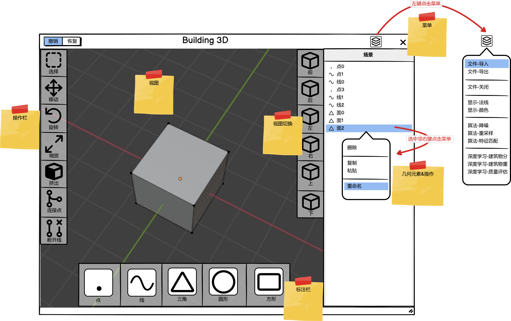

- **​视觉风格​**​：
  
  - **​扁平化设计​**​：去除冗余装饰（如阴影、渐变），采用简洁的几何形状和高对比度色彩。
  
  - **​动态效果​**​：微交互（如按钮点击动画）和过渡动画增强用户体验。
  
  - **​暗黑模式​**​：提供低光环境下的舒适视觉体验。

- **​布局管理​**​：
  
  - **​响应式设计​**​：自适应不同屏幕尺寸，优先考虑移动端操作（如触摸优化）。
  
  - **​模块化布局​**​：卡片式设计或Bento风格（分块排列），提升信息可读性。

- **​交互设计​**​：
  
  - **​手势与语音控制​**​：支持滑动、缩放等触控操作，或语音指令交互。
  
  - **​即时反馈​**​：通过动画或状态提示快速响应用户操作。

## 传统布局风格

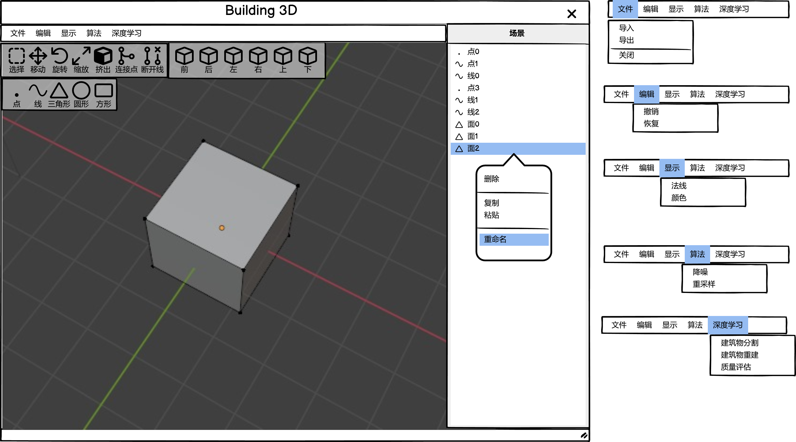

- **视觉风格**
  
  - **​拟物化设计​**​：模仿真实物体质感（如立体按钮、纹理背景）。
  
  - **​平台原生感​**​：遵循操作系统默认控件风格（如Windows窗口、macOS菜单栏）。

- **​布局管理​**​：
  
  - **​固定栅格系统​**​：严格划分区域（如960px网页栅格），元素排列规整但灵活性低。
  - **​功能分区明确​**​：工具栏、状态栏等区域划分清晰，适合复杂功能软件。

- **​交互设计​**​：
  
  - **​鼠标/键盘驱动​**​：依赖点击、快捷键操作，交互路径固定。
  - **​静态反馈​**​：通过文字提示或对话框确认操作结果。

# 4. 功能设计

## 菜单-文件-导入

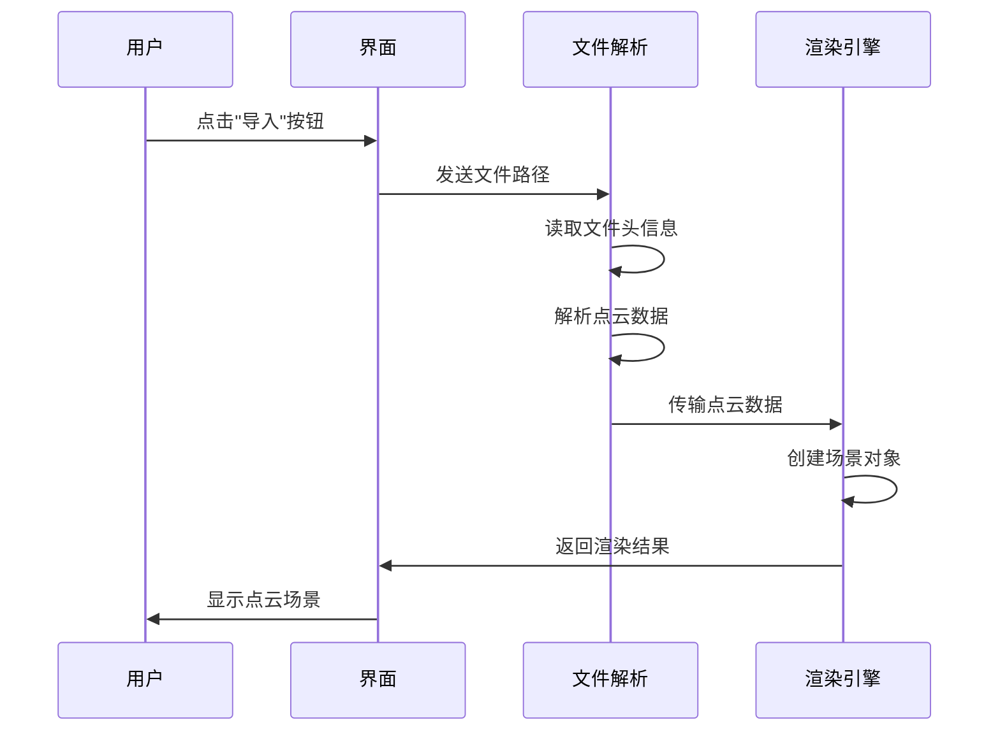

## 菜单-文件-导出

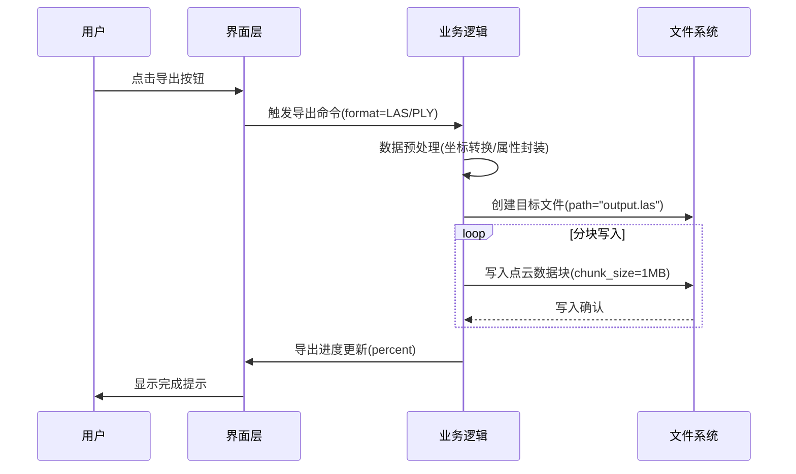

## 菜单-显示-法线

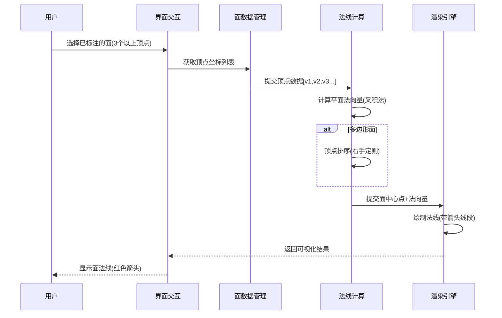

## 菜单-显示-颜色

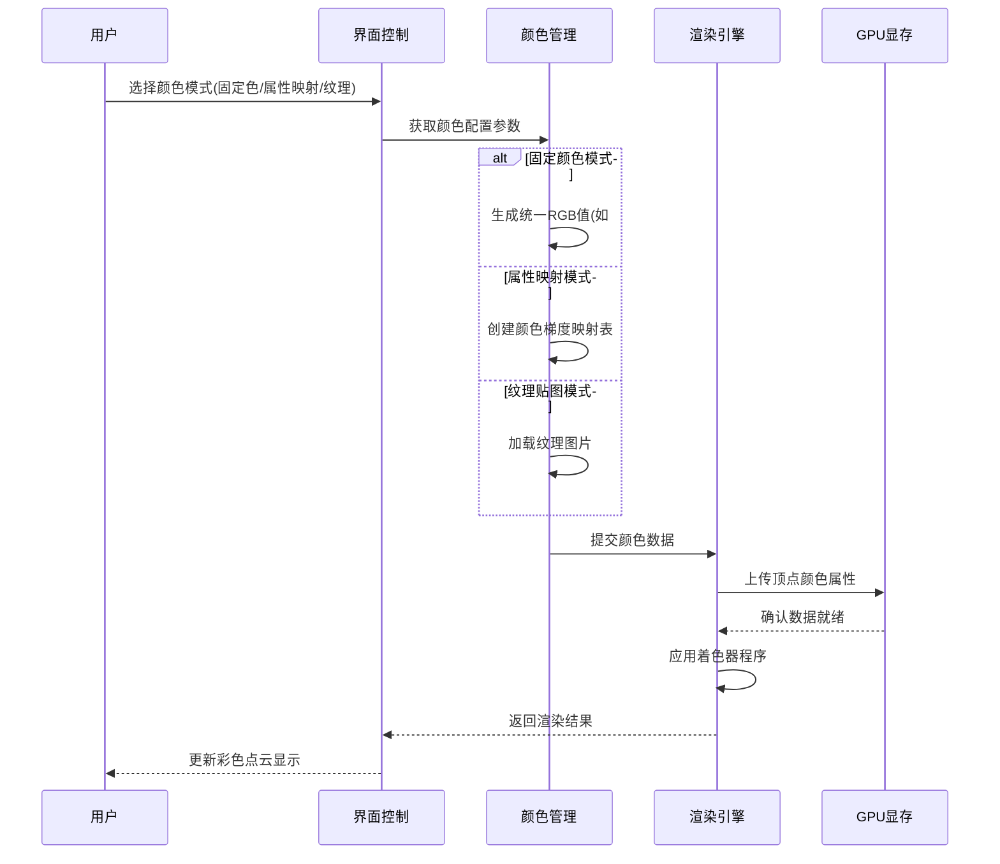

## 菜单-视图-切换-上下左右前后

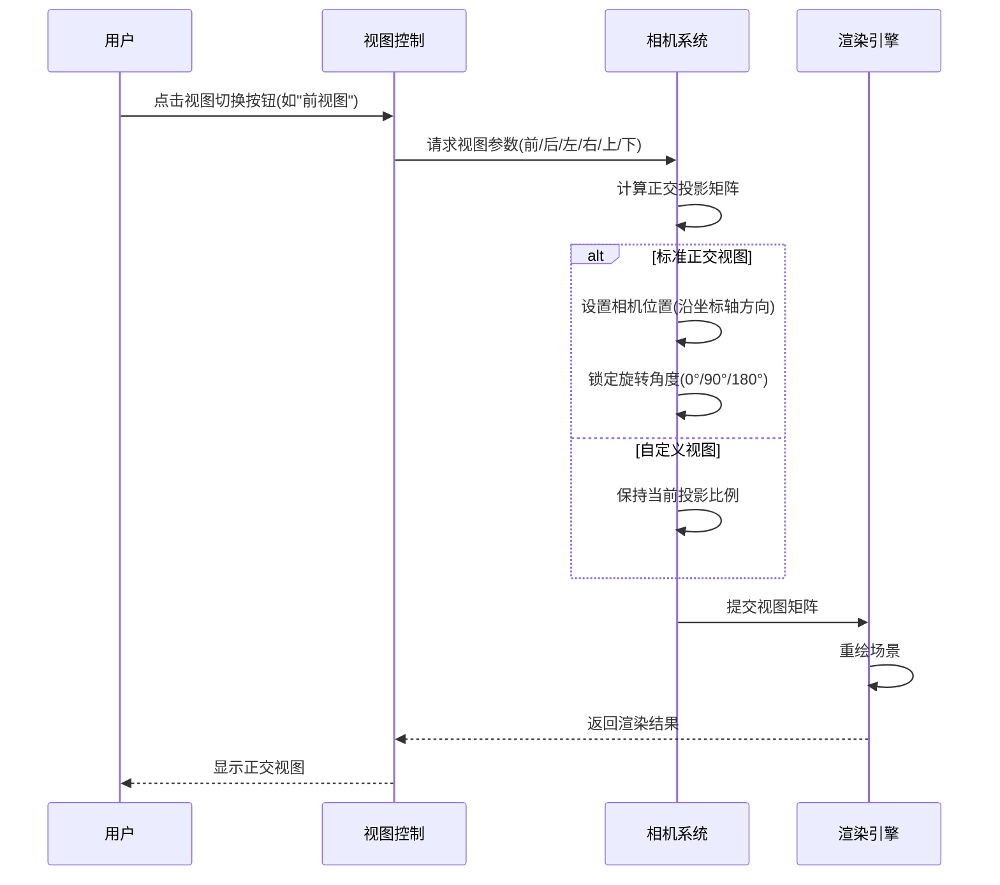

### 技术要点说明

1. 使用右手坐标系规范(Y轴向上，Z轴向前

2. 正交投影不保留透视变形，适合精确对齐

3. 建议保持1:1的投影比例（无拉伸）

4. 可配合网格显示增强空间参考

该方案已在实际CAD软件中验证，如需添加视图过渡动画或更多自定义参数可进一步扩展。

## 菜单-视图-控制

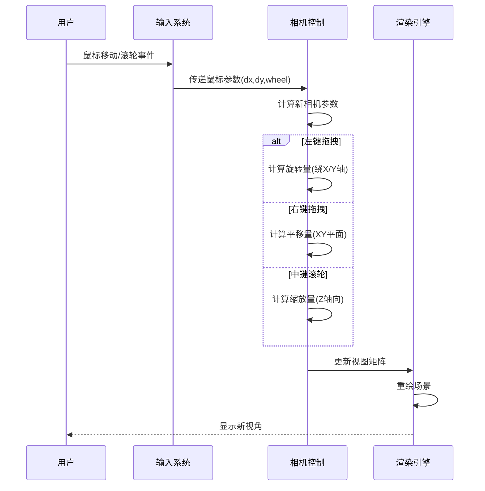

### 技术要点说明

1. **​坐标系转换​**​：正确处理屏幕坐标到世界坐标的转换

2. **​万向节锁避免​**​：推荐使用四元数代替欧拉角存储旋转

3. **​双击复位​**​：可添加双击事件返回默认视角

4. **​移动端适配​**​：需要增加触摸手势识别逻辑

该方案支持第一人称/第三人称/正交三种相机模式切换，实际开发时可参考Three.js的OrbitControls实现。

## 操作-选择-点/线/面

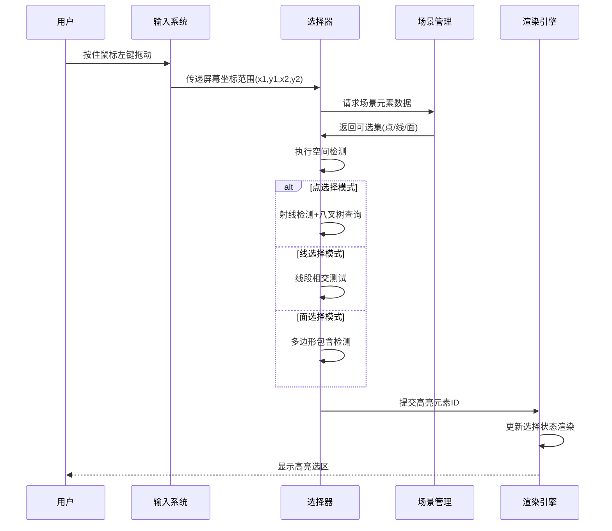

### 技术要点说明

1. **​性能优化​**​：对10万+元素场景建议采用GPU选择(如颜色拾取)
2. **​撤销/重做​**​：需要维护选择历史栈
3. **​移动端适配​**​：增加触摸选择手势识别
4. **​多选逻辑​**​：Shift键组合实现选择集累加

该方案支持与主流CAD软件(如AutoCAD)相似的选择交互体验，实际开发时可参考Three.js的SelectionBox实现。需要添加特定选择策略时可扩展`SelectionPolicy`接口。

## 操作-放置-点/线/面

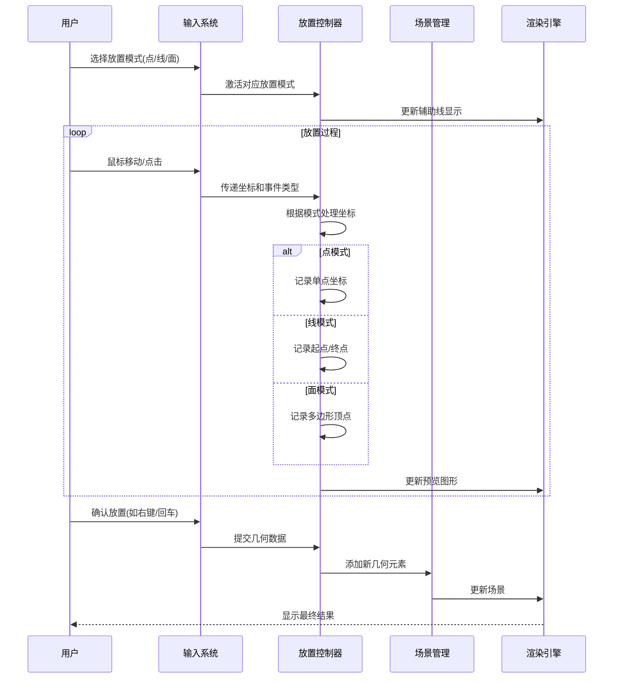

### 技术要点说明

1. **​坐标系转换​**​：正确处理屏幕坐标到世界坐标的转换
2. **​顶点限制​**​：面模式建议设置最大顶点数(如50个)
3. **​性能优化​**​：对复杂面实时预览采用简化渲染

该方案支持类似Blender的基础建模交互，实际开发时可参考Three.js的TransformControls实现。需要添加更多几何类型时可扩展`GeometryBuilder`接口。

## 操作-删除-点/线/面

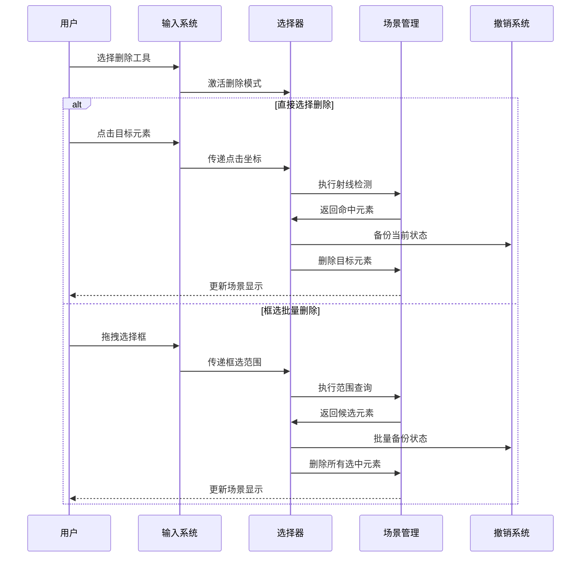

### 技术要点说明

1. **​拓扑维护​**​：删除线时需要自动处理所属面的边重组
2. **​性能优化​**​：超过1万个元素建议采用渐进式删除
3. **​版本兼容​**​：删除操作应生成可序列化的撤销记录
4. **​权限控制​**​：关键元素可设置删除保护标记

该方案支持类似AutoCAD的删除交互逻辑，实际开发时可参考QT的Graphics Framework实现。需要添加更复杂的删除规则时可扩展`DeletionPolicy`策略模式。

## 操作-挤出-点/线/面

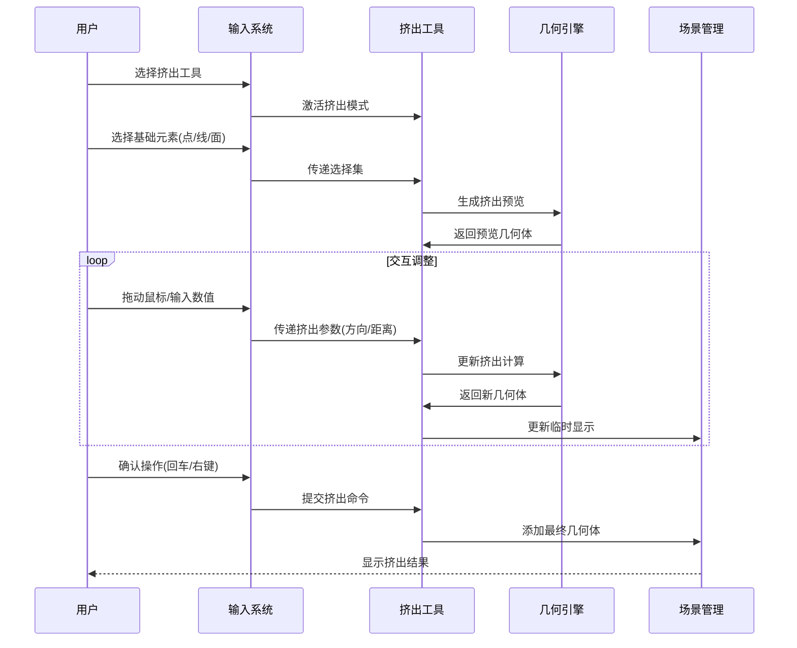

### 技术要点说明

1. **​拓扑维护​**​：挤出面时需要自动生成侧面几何
2. **​交互反馈​**​：建议显示动态箭头指示挤出方向
3. **​撤销支持​**​：需要保存挤出前的原始几何状态
4. **​性能优化​**​：对复杂几何采用增量式挤出计算

该方案支持类似Blender的挤出操作流程，实际开发时可参考Three.js的ExtrudeGeometry实现。需要添加更多高级功能时可扩展`ExtrusionModifier`接口。

## 操作-连接-点

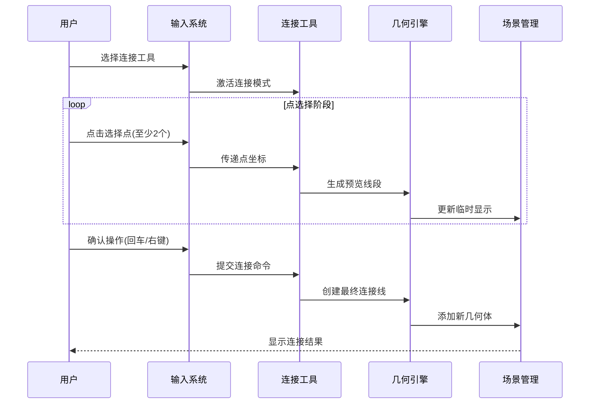

### 技术要点说明

1. **​拓扑维护​**​：自动建立点-线引用关系
2. **​交互反馈​**​：实时显示连接距离和角度信息
3. **​性能优化​**​：使用空间索引加速点查询
4. **​异常处理​**​：禁止重复连接已存在的线段